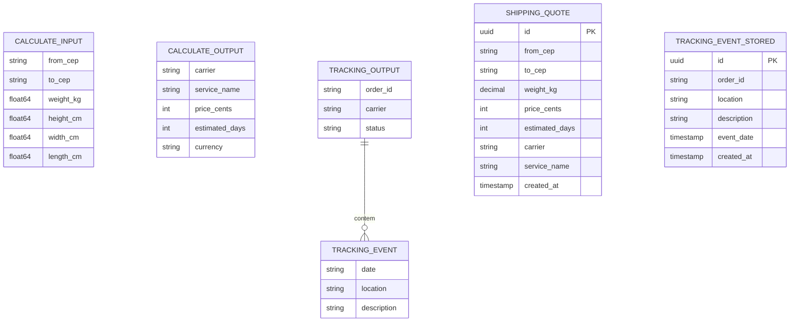

# Data Model — ecom-shipping-service

> Documento vivo do modelo de dados. Atualizado sempre que uma entidade for criada, alterada ou removida.
> **Última atualização:** 2026-06-16

---

## Índice

- [Visão Geral](#visão-geral)
- [Diagrama ER](#diagrama-er)
- [Entidades](#entidades)
- [Decisões de Modelagem](#decisões-de-modelagem)

---

## Visão Geral

O modelo de dados do Shipping Service é atualmente **100% em memória (stub)**, sem banco de dados. As entidades são structs Go que representam os contratos de entrada/saída da API. O núcleo do domínio gira em torno de duas operações: **cálculo de frete** (input → output com preço e prazo) e **rastreamento** (order ID → eventos mock).

**Banco de dados:** PostgreSQL via `database/sql` + `github.com/lib/pq`
**ORM / acesso:** N/A (SQL direto)
**Extensões relevantes:** N/A

---

## Diagrama ER

---

## Entidades

### CalculateInput

> DTO de entrada para o cálculo de frete. Recebido via `POST /api/shipping/calculate`.

**Struct:** `model.CalculateInput`
**Arquivo:** `internal/model/shipping.go:3`

| Campo | Tipo Go | Obrigatório | Descrição |
|-------|---------|-------------|-----------|
| `from_cep` | `string` | Sim | CEP de origem (8 dígitos) |
| `to_cep` | `string` | Sim | CEP de destino (8 dígitos) |
| `weight_kg` | `float64` | Sim | Peso do pacote em kg |
| `height_cm` | `float64` | Não | Altura do pacote em cm (reservado) |
| `width_cm` | `float64` | Não | Largura do pacote em cm (reservado) |
| `length_cm` | `float64` | Não | Comprimento do pacote em cm (reservado) |

**Nota:** Os campos dimensionais (`height_cm`, `width_cm`, `length_cm`) estão definidos na struct mas **não são usados** na lógica de precificação atual. Foram incluídos para preparar futura integração com regras volumétricas das transportadoras.

---

### CalculateOutput

> DTO de saída do cálculo de frete. Retornado com status `200`.

**Struct:** `model.CalculateOutput`
**Arquivo:** `internal/model/shipping.go:12`

| Campo | Tipo Go | Descrição |
|-------|---------|-----------|
| `carrier` | `string` | Transportadora responsável (sempre `"Correios"`) |
| `service_name` | `string` | Nome do serviço (sempre `"PAC"`) |
| `price_cents` | `int` | Valor do frete em centavos |
| `estimated_days` | `int` | Prazo estimado em dias úteis (1–15) |
| `currency` | `string` | Moeda (sempre `"BRL"`) |

---

### TrackingOutput

> DTO de saída do rastreamento. Retornado com status `200`.

**Struct:** `model.TrackingOutput`
**Arquivo:** `internal/model/shipping.go:26`

| Campo | Tipo Go | Descrição |
|-------|---------|-----------|
| `order_id` | `string` | Identificador do pedido (mesmo da URL) |
| `carrier` | `string` | Transportadora (sempre `"Correios"`) |
| `status` | `string` | Status atual da entrega (sempre `"in_transit"`) |
| `events` | `[]TrackingEvent` | Lista de eventos de rastreamento |

---

### TrackingEvent

> Evento individual da linha do tempo de rastreamento.

**Struct:** `model.TrackingEvent`
**Arquivo:** `internal/model/shipping.go:20`

| Campo | Tipo Go | Descrição |
|-------|---------|-----------|
| `date` | `string` | Data/hora do evento (formato `"2006-01-02 15:04"`) |
| `location` | `string` | Cidade/UF onde o evento ocorreu |
| `description` | `string` | Descrição textual do evento |

**Eventos mock atuais:**

| Data | Local | Descrição |
|------|-------|-----------|
| `2026-06-14 08:30` | São Paulo, SP | Objeto postado |
| `2026-06-15 14:15` | Curitiba, PR | Em trânsito para unidade de distribuição |
| `2026-06-16 09:00` | Curitiba, PR | Saiu para entrega ao destinatário |

---

---

### ShippingQuote

> Entidade persistida no PostgreSQL após cada cálculo de frete.

**Struct:** `repository.ShippingQuote`
**Arquivo:** `internal/repository/shipping_quote_repo.go:5`
**Tabela:** `shipping_quotes`

| Campo | Tipo SQL | Tipo Go | Descrição |
|-------|----------|---------|-----------|
| `id` | `UUID` | `string` | Chave primária |
| `from_cep` | `VARCHAR(8)` | `string` | CEP de origem |
| `to_cep` | `VARCHAR(8)` | `string` | CEP de destino |
| `weight_kg` | `DECIMAL(10,2)` | `float64` | Peso do pacote |
| `price_cents` | `INTEGER` | `int` | Valor do frete em centavos |
| `estimated_days` | `INTEGER` | `int` | Prazo estimado em dias |
| `carrier` | `VARCHAR(100)` | `string` | Transportadora |
| `service_name` | `VARCHAR(100)` | `string` | Nome do serviço |
| `created_at` | `TIMESTAMPTZ` | `time.Time` | Data de criação |

---

### TrackingEvent (storage)

> Evento de rastreamento persistido no PostgreSQL.

**Struct:** `repository.TrackingEvent`
**Arquivo:** `internal/repository/tracking_repo.go:5`
**Tabela:** `tracking_events`

| Campo | Tipo SQL | Tipo Go | Descrição |
|-------|----------|---------|-----------|
| `id` | `UUID` | `string` | Chave primária |
| `order_id` | `VARCHAR(100)` | `string` | Identificador do pedido |
| `location` | `VARCHAR(255)` | `string` | Local do evento |
| `description` | `TEXT` | `string` | Descrição do evento |
| `event_date` | `TIMESTAMPTZ` | `time.Time` | Data do evento |
| `created_at` | `TIMESTAMPTZ` | `time.Time` | Data de criação |

---

## Decisões de Modelagem

### ADR-DM-001 — Heurística de distância por prefixo CEP

| Campo | Detalhe |
|-------|---------|
| **Status** | Aceita |
| **Data** | 2026-06-16 |
| **Contexto** | Era necessário estimar distância entre dois CEPs sem depender de API externa de geolocalização (Google Maps, ViaCEP, etc.) durante a fase MVP. |
| **Decisão** | Implementar `estimateDistance` que extrai os primeiros 5 dígitos de cada CEP (prefixo da região), calcula a diferença absoluta e multiplica por 50 para obter a distância em km. Se a diferença for zero (mesma região), retorna 50 km como mínimo. |
| **Alternativas consideradas** | API do Google Maps (custo operacional alto para MVP), tabela lookup de CEP → coordenadas (complexidade de manutenção), distancia fixa (imprecisa). |
| **Consequências** | A heurística é aproximada — dois CEPs com mesmo prefixo mas lados opostos de uma cidade grande podem ter distância subestimada. Isso será resolvido na fase de integração com transportadoras reais, que fornecem o cálculo oficial. |

### ADR-DM-002 — Fórmula de precificação

| Campo | Detalhe |
|-------|---------|
| **Status** | Aceita |
| **Data** | 2026-06-16 |
| **Contexto** | Definir o custo do frete com base nos dados disponíveis (peso e distância estimada). |
| **Decisão** | Adotar a fórmula linear `price_cents = weight_kg * 50 + distance_km * 1`. O prazo é `distance_km / 200`, clampado entre 1 e 15 dias. |
| **Consequências** | Precificação simples e previsível. Pode não refletir a tabela real dos Correios, que considera faixas de peso e CEP regionais —差距 essa será endereçada na integração com transportadoras reais. |
