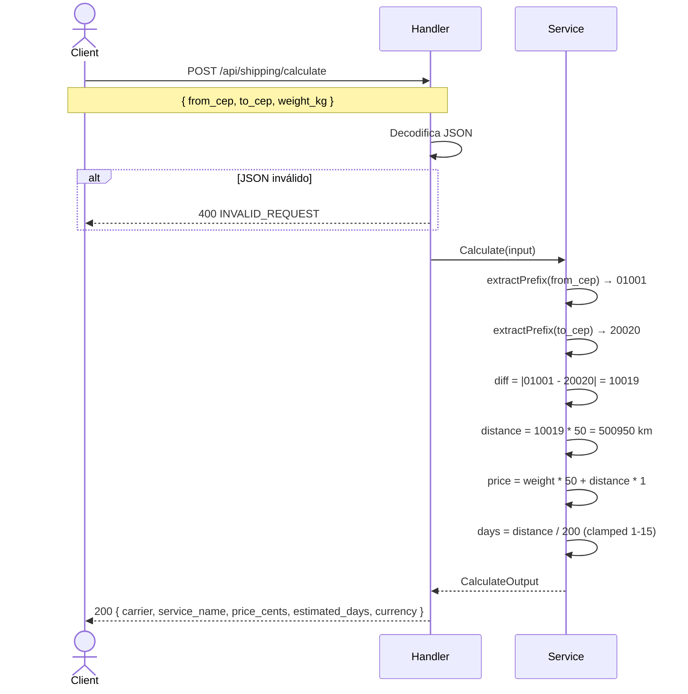
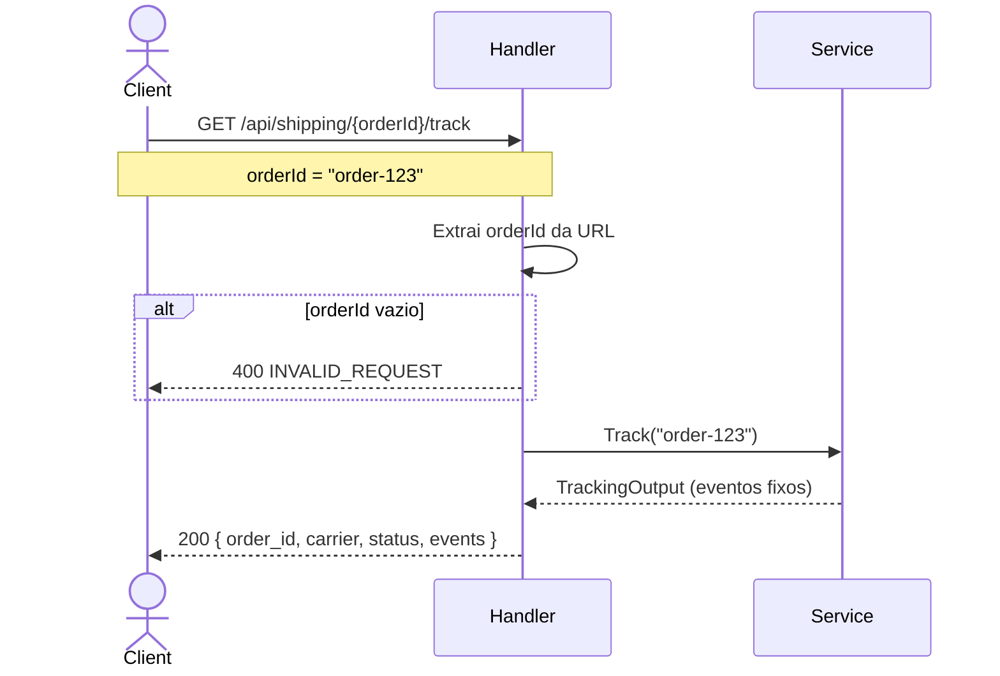

# System Feature Flows

> Registro histórico e incremental dos fluxos internos de cada funcionalidade.
> Este documento cresce a cada nova feature implementada e **nunca tem seções removidas**.

---

## Índice

- [Visão Geral da Arquitetura](#visão-geral-da-arquitetura)
- [Convenções deste Documento](#convenções-deste-documento)
- [Feature: Cálculo de Frete](#feature-cálculo-de-frete)
- [Feature: Rastreamento de Pedido](#feature-rastreamento-de-pedido)

---

## Visão Geral da Arquitetura

> API REST monolítica (sem banco) usando roteador gorilla/mux. Dados em memória com stubs. Sem ORM ou camada de persistência.

**Padrão arquitetural:** Handler → Service (2 camadas)

**Fluxo global de uma requisição:**

```
HTTP Request
    └── Handler (roteamento + parse de request)
            └── Service (lógica de negócio)
```

**Camadas e responsabilidades:**

| Camada    | Responsabilidade                                        |
|-----------|---------------------------------------------------------|
| `handler` | Receber requisições, decodificar JSON, validar entrada, formatar resposta, escrever erros padronizados |
| `service` | Regras de negócio: cálculo de frete, estimativa de distância, geração de rastreamento stub |

---

## Convenções deste Documento

- **Erros de domínio** são retornados como respostas HTTP com envelope `{ data, error: { code, message, details }, meta }`
- **DTOs** (`model.CalculateInput`, `model.CalculateOutput`, `model.TrackingOutput`) trafegam entre handler e service
- **Não há transações ou persistência** — dados são processados e descartados em memória
- **Rastreamento é stub** — não consulta API externa nem banco

---

# Feature: Cálculo de Frete

> **Versão:** 1.0.0
> **Implementada em:** 2026-06-16
> **Status:** Concluída

---

## Resumo

Calcula o valor do frete e o prazo estimado de entrega com base no CEP de origem, CEP de destino e peso do pacote. A distância é estimada por heurística de prefixo CEP, e o preço é derivado de fórmula linear.

**Motivação:** Sem esta feature, o e-commerce não consegue exibir custo de frete no checkout — um requisito obrigatório para conversão de vendas.
**Resultado:** O sistema agora calcula frete em ms, sem dependência externa, com precisão suficiente para o MVP.

---

## Fluxo Principal

### 1. Ponto de Entrada

- **Tipo:** HTTP REST
- **Arquivo:** `cmd/server/main.go:42`
- **Rota/Evento:** `POST /api/shipping/calculate`
- **Autenticação:** Pública

O handler `ShippingHandler.Calculate` recebe a requisição, decodifica o body JSON e delega ao serviço.

---

### 2. Validação de Entrada

- **Arquivo:** `internal/handler/shipping.go:20`
- **Biblioteca:** `encoding/json` (stdlib)

| Campo | Tipo | Obrigatório | Regra de validação |
|-------|------|-------------|---------------------|
| `from_cep` | `string` | Não (runtime) | Deve ser string de 8 dígitos (validado indiretamente pelo service) |
| `to_cep` | `string` | Não (runtime) | Deve ser string de 8 dígitos (validado indiretamente pelo service) |
| `weight_kg` | `float64` | Não (runtime) | Deve ser > 0 |

**Falha de validação:** Se o JSON for malformado, retorna `400` com `{ error: { code: "INVALID_REQUEST", message: "invalid request body" } }`. Campos inválidos (CEP curto, weight zero) produzem resultados com preço zero — não há validação explícita de domínio ainda (melhoria pendente).

---

### 3. Orquestração da Aplicação

- **Arquivo:** `internal/service/shipping.go:16`

O método `Calculate` executa em 4 passos:

1. Extrai os prefixos (primeiros 5 dígitos) de `from_cep` e `to_cep`
2. Calcula a distância estimada: `|prefixo_from - prefixo_to| * 50` (mínimo 50 km)
3. Calcula o preço: `peso * 50 + distancia * 1` (resultado em centavos)
4. Calcula os dias estimados: `distancia / 200`, clampado entre 1 e 15

---

### 4. Regras de Negócio

| Regra | Descrição | Localização no Código |
|-------|-----------|----------------------|
| Distância mínima | Se a diferença entre prefixos CEP for < 1, assume 50 km | `service/shipping.go:50` |
| Fórmula de preço | `price = weight * 50 + distance * 1` (centavos) | `service/shipping.go:18-19` |
| Fórmula de prazo | `days = distance / 200`, mínimo 1, máximo 15 | `service/shipping.go:56-65` |
| Transportadora fixa | Sempre `Correios` / `PAC` | `service/shipping.go:25-26` |
| Moeda fixa | Sempre `BRL` | `service/shipping.go:29` |

---

### 5. Persistência / Integrações

**Repositórios utilizados:** Nenhum (cálculo puramente funcional).

**Integrações externas:** Nenhuma (distância estimada por heurística interna).

---

### 6. Resposta Final

**Sucesso — `200`:**

```json
{
  "carrier": "Correios",
  "service_name": "PAC",
  "price_cents": 255,
  "estimated_days": 3,
  "currency": "BRL"
}
```

**Campos retornados:**

| Campo | Tipo | Descrição |
|-------|------|-----------|
| `carrier` | `string` | Transportadora |
| `service_name` | `string` | Nome do serviço |
| `price_cents` | `int` | Valor em centavos (peso * 50 + distância * 1) |
| `estimated_days` | `int` | Prazo em dias (distância / 200, clamp 1–15) |
| `currency` | `string` | Moeda (sempre `BRL`) |

---

## Fluxos Alternativos e Erros

| Cenário | HTTP Status | Código de Erro | Mensagem |
|---------|-------------|----------------|----------|
| JSON inválido no body | `400` | `INVALID_REQUEST` | `invalid request body` |

> Todos os erros retornam o mesmo envelope:
> ```json
> { "data": null, "error": { "code": "ERROR_CODE", "message": "...", "details": {} }, "meta": { "requestId": "abc123" } }
> ```

---

## Diagrama de Sequência



---

## Decisões Técnicas

### ADR-001 — Heurística de distância via prefixo CEP

| Campo | Detalhe |
|-------|---------|
| **Status** | Aceita |
| **Data** | 2026-06-16 |
| **Contexto** | Calcular frete sem API de geolocalização nem banco de CEPs. |
| **Decisão** | Usar os primeiros 5 dígitos do CEP como proxy de região geográfica. A diferença absoluta entre prefixos multiplicada por 50 produz uma distância aproximada em km. |
| **Consequências** | Cálculo rápido (~μs), sem dependências externas. Precisão limitada — substituir por integração real de transportadora no futuro. |

---

# Feature: Rastreamento de Pedido

> **Versão:** 1.0.0
> **Implementada em:** 2026-06-16
> **Status:** Concluída

---

## Resumo

Retorna eventos de rastreamento mock para um `orderId`. O rastreamento é completamente stub — dados são fixos e não refletem estado real de entrega.

**Motivação:** Fornecer um contrato de API de rastreamento para que outros serviços (Order Service, frontend) possam consumi-lo e desenvolver suas integrações em paralelo.
**Resultado:** O endpoint `GET /api/shipping/{orderId}/track` está disponível e retorna dados no formato esperado, permitindo o desenvolvimento paralelo das interfaces dependentes.

---

## Fluxo Principal

### 1. Ponto de Entrada

- **Tipo:** HTTP REST
- **Arquivo:** `cmd/server/main.go:43`
- **Rota/Evento:** `GET /api/shipping/{orderId}/track`
- **Autenticação:** Pública

---

### 2. Validação de Entrada

- **Arquivo:** `internal/handler/shipping.go:32`
- **Biblioteca:** `gorilla/mux.Vars`

| Campo | Tipo | Obrigatório | Regra de validação |
|-------|------|-------------|---------------------|
| `orderId` | `string` | Sim | Extraído da URL via mux.Vars |

**Falha de validação:** Se `orderId` estiver vazio, retorna `400` com `{ error: { code: "INVALID_REQUEST", message: "orderId is required" } }`.

---

### 3. Orquestração da Aplicação

- **Arquivo:** `internal/service/shipping.go:33`

O método `Track` executa em 1 passo:

1. Retorna um `TrackingOutput` fixo com 3 eventos mock e status `"in_transit"`

---

### 4. Regras de Negócio

| Regra | Descrição | Localização no Código |
|-------|-----------|----------------------|
| Stub de rastreamento | Eventos são fixos, independentes do orderId ou carrier real | `service/shipping.go:34-43` |
| Status fixo | Sempre `"in_transit"` | `service/shipping.go:37` |

---

### 5. Persistência / Integrações

**Repositórios utilizados:** Nenhum.

**Integrações externas:** Nenhuma (stub).

---

### 6. Resposta Final

**Sucesso — `200`:**

```json
{
  "order_id": "order-123",
  "carrier": "Correios",
  "status": "in_transit",
  "events": [
    {
      "date": "2026-06-14 08:30",
      "location": "São Paulo, SP",
      "description": "Objeto postado"
    },
    {
      "date": "2026-06-15 14:15",
      "location": "Curitiba, PR",
      "description": "Em trânsito para unidade de distribuição"
    },
    {
      "date": "2026-06-16 09:00",
      "location": "Curitiba, PR",
      "description": "Saiu para entrega ao destinatário"
    }
  ]
}
```

**Campos retornados:**

| Campo | Tipo | Descrição |
|-------|------|-----------|
| `order_id` | `string` | Identificador do pedido (ecoado da URL) |
| `carrier` | `string` | Transportadora (sempre `"Correios"`) |
| `status` | `string` | Status atual (sempre `"in_transit"`) |
| `events` | `array` | Lista de eventos de rastreamento |

---

## Fluxos Alternativos e Erros

| Cenário | HTTP Status | Código de Erro | Mensagem |
|---------|-------------|----------------|----------|
| orderId vazio | `400` | `INVALID_REQUEST` | `orderId is required` |

> Todos os erros retornam o mesmo envelope:
> ```json
> { "data": null, "error": { "code": "ERROR_CODE", "message": "...", "details": {} }, "meta": { "requestId": "abc123" } }
> ```

---

## Diagrama de Sequência



---

## Decisões Técnicas

### ADR-002 — Rastreamento stub para viabilizar desenvolvimento paralelo

| Campo | Detalhe |
|-------|---------|
| **Status** | Aceita |
| **Data** | 2026-06-16 |
| **Contexto** | O Order Service e o frontend dependem do endpoint de tracking, mas a integração real com Correios ainda não estava disponível. |
| **Decisão** | Implementar o endpoint com dados mock fixos, mas com o contrato de resposta idêntico ao que será usado futuramente. |
| **Consequências** | Permite desenvolvimento paralelo. Quando a integração real for implementada, o contrato da API não muda — apenas a fonte dos eventos troca de stub para real. |

---

# Feature: Persistência em PostgreSQL

> **Versão:** 1.0.0
> **Implementada em:** 2026-06-17
> **Status:** Concluída

## Resumo

Camada de persistência com `database/sql` + `github.com/lib/pq`. Cria as tabelas `shipping_quotes` e `tracking_events` via DDL automática na inicialização. Fornece funções CRUD básicas em `internal/repository/`.

**Motivação:** Substituir dados em memória por armazenamento durável, preparando o serviço para ambiente de produção.
**Resultado:** Conexão PostgreSQL gerenciada, tabelas criadas automaticamente, funções `SaveQuote`, `GetQuoteByID`, `SaveEvent`, `GetEventsByOrderID` disponíveis.

---

## Fluxo Principal

### 1. Conexão

- **Arquivo:** `internal/repository/postgres.go:8`
- **Função:** `NewPostgres(dsn string) (*sql.DB, error)`
- **Passos:**
  1. `sql.Open("postgres", dsn)`
  2. `db.Ping()` — valida a conexão
  3. `createTables(db)` — executa DDL (`CREATE TABLE IF NOT EXISTS`)

Se a conexão falhar, o servidor loga um warning e continua sem banco (modo degradado para desenvolvimento).

---

### 2. Tabelas

| Tabela | Colunas | Chave |
|--------|---------|-------|
| `shipping_quotes` | `id UUID`, `from_cep`, `to_cep`, `weight_kg`, `price_cents`, `estimated_days`, `carrier`, `service_name`, `created_at` | `id` |
| `tracking_events` | `id UUID`, `order_id`, `location`, `description`, `event_date`, `created_at` | `id` |

---

## Decisões Técnicas

### ADR-003 — DDL automática na inicialização

| Campo | Detalhe |
|-------|---------|
| **Status** | Aceita |
| **Data** | 2026-06-17 |
| **Contexto** | Evitar scripts SQL manuais e migrações complexas na fase MVP. |
| **Decisão** | Executar `CREATE TABLE IF NOT EXISTS` dentro de `NewPostgres`. |
| **Consequências** | Schema sempre sincronizado com o código. Para produção futura, migrações versionadas (golang-migrate) devem substituir esta abordagem. |

---

# Feature: Estrutura para Transportadoras Reais (Carrier Interface)

> **Versão:** 1.0.0
> **Implementada em:** 2026-06-17
> **Status:** Concluída

## Resumo

Define a interface `Carrier` que padroniza o contrato de cálculo de frete e rastreamento para qualquer transportadora. A lógica legada foi movida para `StubCarrier`, e um scaffold `CorreiosCarrier` foi criado para futura integração.

**Motivação:** Permitir que múltiplas transportadoras (Correios, Jadlog, Loggi) sejam plugadas sem modificar o `ShippingService` nem os handlers.
**Resultado:** Arquitetura de adapter — `ShippingService` delega para qualquer implementação de `Carrier`.

---

## Fluxo Principal

### Contrato

- **Arquivo:** `internal/service/carrier.go`
- **Interface:**
  - `Calculate(input model.CalculateInput) (model.CalculateOutput, error)`
  - `Track(orderID string) (model.TrackingOutput, error)`

### Implementações

| Implementação | Arquivo | Comportamento |
|---------------|---------|---------------|
| `StubCarrier` | `internal/service/carrier_stub.go` | Lógica heurística legada (prefixo CEP + peso). Track retorna `ErrNotFound` para qualquer orderID diferente de `"order-123"` |
| `CorreiosCarrier` | `internal/service/carrier_correios.go` | Scaffold — todos os métodos retornam `"Correios integration not implemented yet"` |

### Integração com ShippingService

- `ShippingService` agora recebe um `Carrier` no construtor e delega `Calculate` e `Track` para ele.
- Nenhuma lógica de negócio permanece em `ShippingService` — ele é puramente um facade.

---

# Feature: Testes de Handler (Integração)

> **Versão:** 1.0.0
> **Implementada em:** 2026-06-17
> **Status:** Concluída

## Resumo

Testes de integração HTTP usando `httptest.NewRecorder` e `httptest.NewRequest` para validar os handlers sem necessidade de servidor rodando.

**Motivação:** Garantir que a camada HTTP responde corretamente (status codes, corpo da resposta) para cenários de sucesso e erro.
**Resultado:** 4 cenários cobrindo `POST /api/shipping/calculate` (200 e 400) e `GET /api/shipping/{orderId}/track` (200 e 404).

---

## Cenários

### 1. `POST /api/shipping/calculate` — 200

Body válido com `from_cep`, `to_cep` e `weight_kg`. Retorna `200` com JSON contendo `carrier`, `price_cents`, `estimated_days`.

### 2. `POST /api/shipping/calculate` — 400

Body malformado (`{invalid`). Retorna `400` com envelope de erro padronizado.

### 3. `GET /api/shipping/{orderId}/track` — 200

orderId = `"order-123"`. Retorna `200` com `order_id`, `carrier`, `status`, `events`.

### 4. `GET /api/shipping/{orderId}/track` — 404

orderId = `"nonexistent"`. Retorna `404` com `NOT_FOUND` — o `StubCarrier` só reconhece `"order-123"`.

---

## Execução

```bash
go test ./internal/handler/... -v
```
